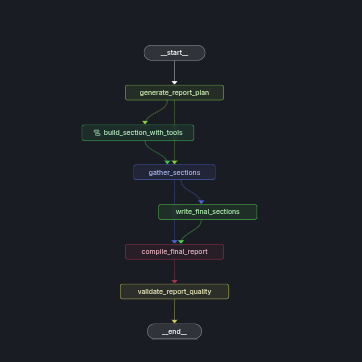

<div align="center">

# \N{DNA DOUBLE HELIX} MedReportAI

**AI-powered biomedical research report generator**

*Parallel LangGraph agents that plan → retrieve → synthesise → compile evidence-based medical reports from PubMed and
the web.*

[](https://www.python.org/)
[](https://github.com/langchain-ai/langgraph)
[](https://dspy-docs.vercel.app/)
[](https://www.deepseek.com/)
[](https://opensource.org/licenses/MIT)

</div>

---

## \N{SPARKLES} Features

| Feature                                        | Description                                                                                           |
|------------------------------------------------|-------------------------------------------------------------------------------------------------------|
| \N{MICROSCOPE} **Automated Report Planning**       | DSPy-driven planner generates structured section outlines from a single research query                |
| \N{SATELLITE ANTENNA} **Triple-Source Retrieval**         | Live PubMed search via BioPython Entrez, local PubMed FAISS index, and Tavily web search              |
| \N{BRAIN} **Parallel Agent Architecture**     | LangGraph orchestrates multiple section-writing agents concurrently with tool access                  |
| \N{MEMO} **Scratchpad Protocol**             | Agents follow a disciplined extract → note → synthesise workflow for traceable research               |
| \N{CLOCKWISE RIGHTWARDS AND LEFTWARDS OPEN CIRCLE ARROWS} **Hybrid Retrieval (BM25 + Dense)** | Ensemble retriever with cross-encoder reranking for high-precision document retrieval                 |
| \N{LEFT-POINTING MAGNIFYING GLASS} **Live PubMed Search**              | On-demand querying of PubMed with automatic CSV persistence and active-source switching               |
| \N{BAR CHART} **Unified Dataset Per Run**         | Single CSV and FAISS index per run, all section branches share one deduplicated dataset               |
| \N{INPUT NUMBERS} **Numbered Citation System**        | Academic-style `[N]` inline citations with a clean References section at the end                      |
| \N{WHITE HEAVY CHECK MARK} **Pre-synthesis Verification**          | Evidence quality gate checks source count, quantitative depth, and scratchpad length before synthesis |

---

## \N{BUILDING CONSTRUCTION} Architecture

MedReportAI is a multi-agent LangGraph pipeline with three main phases:

### Two-Phase Section Writer

Each research section runs a two-phase loop inside a parallel sub-graph:

1. **Phase 1 - Tool-Based Research**: The section agent uses PubMed search, FAISS retrieval, and web search tools to
   gather evidence into a scratchpad. A verification gate checks the scratchpad before advancing.
2. **Phase 2 - Synthesis**: The agent writes the final section from the scratchpad, using `[N]` numbered citations that
   map to the shared citation registry.

### Unified Dataset Per Run

Every pipeline run receives a unique `run_id`. All `pubmed_scraper_tool` calls within a run write to one shared CSV
file, deduplicated by PMID. A single FAISS index reflects this unified dataset and is queried by `retriever_tool` across
all section branches.

### Numbered Citation System

A citation registry (`dict[str, int]`) maps each unique source URL to a stable number. Section agents emit `[N]` inline
citations during synthesis. The final report includes a References section containing only sources whose `[N]` appears
in the body text.

```
┌──────────────────────────────────────────────────────────┐
│                   LangGraph Pipeline                      │
│                                                          │
│  ┌──────────────┐    ┌─────────────────────────────┐     │
│  │ Plan Report  │───▶│ Build Sections (parallel)   │     │
│  │  (DSPy)      │    │  ┌─────────┐  ┌─────────┐  │     │
│  └──────────────┘    │  │Section 1│  │Section N│  │     │
│                      │  │Phase 1: │  │Phase 1: │  │     │
│                      │  │ research│  │ research│  │     │
│                      │  │Phase 2: │  │Phase 2: │  │     │
│                      │  │ synth.  │  │ synth.  │  │     │
│                      │  └─────────┘  └─────────┘  │     │
│                      └────────────┬────────────────┘     │
│                                   ▼                      │
│  ┌──────────────┐    ┌─────────────────────────────┐     │
│  │ Compile      │◀───│ Write Final Sections        │     │
│  │ Final Report │    │ (intro, conclusion)          │     │
│  │ + References │    └─────────────────────────────┘     │
│  └──────────────┘                                        │
└──────────────────────────────────────────────────────────┘
       │               │               │
┌────────────┐  ┌────────────┐  ┌────────────┐
│ PubMed RAG │  │ Live       │  │ Tavily     │
│ (FAISS +   │  │ PubMed     │  │ Web        │
│  BM25)     │  │ Search     │  │ Search     │
└────────────┘  └────────────┘  └────────────┘
       │               │               │
       └───────────────┼───────────────┘
                       ▼
          ┌──────────────────────┐
          │ Unified CSV + FAISS  │
          │ (one per run_id)     │
          └──────────────────────┘
```

### Graph Topology

- **Entry**: `generate_plan`
- **Fan-out**: `initiate_section_writing` → parallel `build_section_with_tools` sub-graphs
- **Gather**: `gather_completed_sections`
- **Fan-out**: `initiate_final_section_writing` → parallel `write_final_sections`
- **Compile**: `compile_final_report`
- **Validate**: `validate_report_quality`
- **Exit**: `END`

<div align="center">
  
  <p><em>LangGraph Studio view of the pipeline graph</em></p>
</div>

---

## \N{OPEN FILE FOLDER} Project Structure

```
MedReportAI/
├── app.py                  # LangGraph pipeline definition & entry point
├── config.py               # Model, retriever, and path configuration
├── langgraph.json          # LangGraph Studio deployment config
├── pyproject.toml          # Project metadata & dependencies
│
├── agents/
│   └── planner.py          # Report plan generation & final section writing (DSPy)
│
├── core/
│   ├── nodes.py            # Graph node functions (fan-out, synthesis, compile)
│   ├── quality.py          # Citation validation, reference building, truncation detection
│   ├── schemas.py          # Pydantic schemas (scratchpad ops, Section model)
│   ├── signatures.py       # DSPy signatures (ReportPlanner, FinalInstructions)
│   ├── states.py           # LangGraph state definitions with reducer annotations
│   ├── tool_node.py        # Tool execution node with routing + citation registry
│   └── verification.py     # Pre-synthesis verification gate
│
├── rag/
│   ├── chain.py            # RAG chain construction
│   ├── embeddings.py       # FastEmbed wrapper for LangChain
│   ├── retrieval_builder.py # Ensemble retriever + cross-encoder reranker
│   ├── retrieval_formatter.py # Structured report from retriever results
│   └── source_formatter.py # Web search result formatting & deduplication
│
├── tools/
│   ├── pubmed_search.py    # Live PubMed search with unified CSV persistence
│   ├── retrieval.py        # PubMed FAISS retriever tool
│   ├── web_search.py       # Tavily web search tool
│   ├── scratchpad.py       # Read/write/clear scratchpad operations
│   └── query_generator.py  # DSPy multi-query generator
│
├── prompts/
│   ├── planner.py          # Context persona & report structure prompts
│   ├── section_writer.py   # Two-phase section writing protocol
│   └── scraper.py          # PubMed query parsing prompt
│
├── scripts/
│   └── pubmed_scraper.py   # PubMed article scraper (BioPython Entrez + DeepSeek)
│
├── utils/
│   ├── data_processing.py  # CSV loading, semantic chunking, FAISS indexing
│   ├── formatting.py       # Rich console formatters
│   ├── helpers.py          # Environment setup, logging, file helpers
│   └── scratchpad_helpers.py # Scratchpad read/write/clear handlers
│
└── tests/                  # Detailed test suite
```

---

## \N{ROCKET} Getting Started

### Prerequisites

- **Python 3.12+**
- A [DeepSeek API key](https://platform.deepseek.com/)
- A [Tavily API key](https://tavily.com/) (for web search)
- *(Optional)* An email for [NCBI Entrez](https://www.ncbi.nlm.nih.gov/account/) (for live PubMed search)

### Installation

```bash
git clone https://github.com/Chrisolande/MedReportAI.git
cd MedReportAI

# Install with uv (recommended)
uv sync --extra dev

# Or with pip
pip install -e ".[dev]"
```

### Environment Variables

Create a `.env` file in the project root:

```env
DEEPSEEK_API_KEY=your_deepseek_api_key_here
TAVILY_API_KEY=your_tavily_api_key_here
ENTREZ_EMAIL=your_email@example.com  # Optional: for live PubMed search
```

---

## \N{DESKTOP COMPUTER} Usage

### LangGraph Studio

The sole interface is [LangGraph Studio](https://docs.langchain.com/langsmith/studio). Open the project directory in
LangGraph Studio and invoke the graph with a topic:

```json
{
  "topic": "Long-term pediatric health outcomes in conflict settings"
}
```

The pipeline runs fully autonomously from topic input to final report.

### Programmatic API

```python
from app import graph

result = await graph.ainvoke(
    {"topic": "Impact of malnutrition on child neurodevelopment"},
    config={
        "configurable": {
            "context": "You are a pediatric nutrition researcher...",
            "report_organization": "Structure the report with..."
        }
    }
)

print(result["final_report"])
```

---

## \N{GEAR} Configuration

All settings are centralized in `config.py`:

| Setting                | Default                                  | Description                 |
|------------------------|------------------------------------------|-----------------------------|
| `deepseek_model`       | `deepseek-chat`                          | LLM model                   |
| `deepseek_temperature` | `1.3`                                    | Generation temperature      |
| `max_tokens`           | `512`                                    | Maximum tokens per LLM call |
| `embedding_model`      | `sentence-transformers/all-MiniLM-L6-v2` | Embedding model (FastEmbed) |
| `k`                    | `15`                                     | Documents to retrieve       |
| `sparse_weight`        | `0.65`                                   | BM25 weight in ensemble     |
| `dense_weight`         | `0.35`                                   | Dense retrieval weight      |
| `top_n`                | `5`                                      | Documents after reranking   |

---

## \N{HAMMER AND WRENCH} Tech Stack

| Layer                | Technology                                                                             |
|----------------------|----------------------------------------------------------------------------------------|
| **Orchestration**    | [LangGraph](https://github.com/langchain-ai/langgraph) - stateful multi-agent pipeline |
| **Prompt Framework** | [DSPy](https://dspy-docs.vercel.app/) - structured signatures                          |
| **LLM**              | [DeepSeek](https://www.deepseek.com/)                                                  |
| **Retrieval**        | FAISS + BM25 ensemble with FastEmbed reranking                                         |
| **Live Search**      | [BioPython Entrez](https://biopython.org/) - real-time PubMed                          |
| **Web Search**       | [Tavily](https://tavily.com/) - web search with raw content                            |
| **Tracing**          | [LangSmith](https://smith.langchain.com/) - observability                              |

---

## \N{TEST TUBE} Development

```bash
# Run tests
uv run pytest tests/ -v

# Lint
uvx ruff check .
uvx ruff format .

# Complexity check
uv run radon cc -s -a core/ tools/ scripts/
```

---

## \N{PAGE FACING UP} License

This project is licensed under the [MIT License](LICENSE).

---

<div align="center">

**Built with \N{HEAVY BLACK HEART} by [@Chrisolande](https://github.com/Chrisolande)**

</div>
